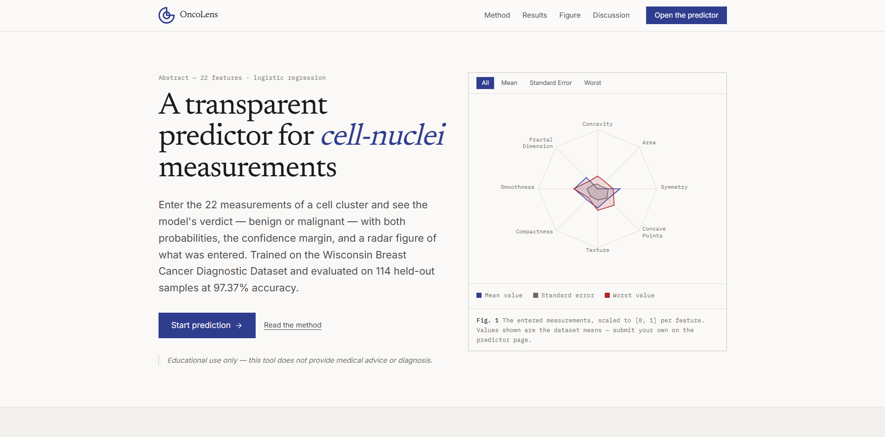

# Breast Cancer Prediction


A full-stack machine learning web application that predicts whether a breast tumor is **Benign** or **Malignant** based on digitized FNA (fine needle aspirate) cell measurements. Built as an educational portfolio project showcasing modern frontend development, backend API engineering, and ML deployment — without retraining the model.

**Live:** [https://oncolens-chi.vercel.app/](https://oncolens-chi.vercel.app/)



## Overview

Version 2.0 replaces the legacy Streamlit dashboard with a modern architecture:

```
React SPA (Vite) ──axios──▶ FastAPI REST API ──▶ scaler.pkl → model.pkl ──▶ JSON
     Vercel                       Render                    models/
```

- **Frontend** — React 19 + Vite, Tailwind CSS v4, Recharts (radar chart), React Hook Form + Zod (22-field validation)
- **Backend** — FastAPI + Pydantic, deep ML inference service (scikit-learn, joblib, numpy), CORS env-configured
- **Model** — Tuned Logistic Regression (no retraining), 22 features selected via VIF multicollinearity removal
- **Deployment** — Frontend on Vercel, backend on Render (free tier)

The ML pipeline (exploration → preprocessing → modeling) is documented in Jupyter notebooks under `notebook/`.

## Dataset

**Wisconsin Breast Cancer Diagnostic Dataset** (UCI)

- 569 samples of breast mass measurements
- 30 raw features computed from digitized FNA images
- After VIF-based multicollinearity removal: **22 model features**
- Classes: Malignant (M = 1), Benign (B = 0)

Features include mean, standard error, and worst (largest) values for: radius, texture, perimeter, area, smoothness, compactness, concavity, concave points, symmetry, and fractal dimension.

## Model Performance

Logistic Regression was selected after comparing 7 algorithms with cross-validation:

| Metric | Score |
|---|---|
| Accuracy | 97.37% |
| Precision | 97.56% |
| Recall | 95.24% |
| F1-Score | 96.39% |
| ROC-AUC | 99.04% |

**Confusion Matrix** (test set, 114 samples): TN 71 · FP 1 · FN 2 · TP 40

### Top 5 Features by Importance

| Rank | Feature | Importance |
|---|---|---|
| 1 | concave points_worst | 19.65% |
| 2 | area_worst | 17.30% |
| 3 | concave points_mean | 14.07% |
| 4 | area_se | 12.82% |
| 5 | concavity_worst | 8.07% |

## Tech Stack

| Layer | Technologies |
|---|---|
| Frontend | React 19, Vite, Tailwind CSS v4, Recharts, React Hook Form, Zod, Axios, Lucide React |
| Backend | FastAPI, Pydantic v2, scikit-learn, joblib, numpy, uvicorn, uv |
| ML/Data | scikit-learn, pandas, numpy, joblib |
| Deployment | Vercel (frontend), Render (backend), Streamlit Cloud (legacy) |

## Project Structure

```
breast-cancer-prediction/
├── frontend/              # React SPA (Vite)
│   ├── src/
│   │   ├── components/    # FeatureInput, FeatureGroup, PredictionCard, RadarChart...
│   │   ├── pages/         # LandingPage, PredictPage
│   │   ├── services/      # prediction.js (axios → /api/v1/predict)
│   │   ├── hooks/         # usePrediction.js
│   │   ├── constants/     # FEATURE_META, FEATURE_GROUPS, schema
│   │   └── utils/         # scaling.js (radar normalization)
│   └── vercel.json        # SPA rewrite for client-side routing
├── backend/               # FastAPI inference service
│   ├── app/
│   │   ├── main.py        # FastAPI app, CORS, lifespan, 500 handler
│   │   ├── constants.py   # FEATURE_KEYS (22), FEATURE_BOUNDS, LABEL_MAP
│   │   ├── schemas/       # Pydantic request (generated) / response
│   │   ├── services/      # InferenceService (deep module: load → predict)
│   │   ├── routers/       # POST /api/v1/predict, GET /health
│   │   └── dependencies.py
│   ├── tests/             # pytest (30 tests: API contract, schema, inference, constants)
│   ├── requirements.txt   # pinned via uv export
│   ├── pyproject.toml     # uv-managed deps
│   └── README.md          # backend-specific run/test instructions
├── app/                   # Legacy Streamlit app (still live on Streamlit Cloud)
├── data/
│   └── processed/         # removed_multicollinearity.csv (22 features)
├── models/                # trained artifacts (committed, never retrain)
│   ├── final_model_logistic_regression.pkl
│   └── scaler.pkl
├── notebook/              # Jupyter notebooks (ML pipeline documentation)
├── results/               # model metrics CSVs
├── screenshots/           # README images
├── render.yaml            # Render Blueprint
└── README.md
```

## API

### `POST /api/v1/predict`

Send the 22 model features (exact column names, spaces preserved) as JSON.

**Request:**

```json
{
  "texture_mean": 14.36,
  "smoothness_mean": 0.09779,
  "compactness_mean": 0.08129,
  "concave points_mean": 0.04781,
  "symmetry_mean": 0.1885,
  "fractal_dimension_mean": 0.05766,
  "texture_se": 0.7886,
  "area_se": 23.56,
  "smoothness_se": 0.008462,
  "compactness_se": 0.0146,
  "concavity_se": 0.02387,
  "concave points_se": 0.01315,
  "symmetry_se": 0.0198,
  "fractal_dimension_se": 0.0023,
  "texture_worst": 19.26,
  "area_worst": 711.2,
  "smoothness_worst": 0.144,
  "compactness_worst": 0.1773,
  "concavity_worst": 0.239,
  "concave points_worst": 0.1288,
  "symmetry_worst": 0.2977,
  "fractal_dimension_worst": 0.07259
}
```

**Response (200):**

```json
{
  "prediction": "Benign",
  "probability": { "benign": 93.9, "malignant": 6.1 }
}
```

**Errors:** 422 (validation: missing/extra/wrong-type/out-of-range field), 500 (internal).

**Example (curl):**

```bash
curl -X POST https://breast-cancer-prediction-api-4dy1.onrender.com/api/v1/predict \
  -H "Content-Type: application/json" \
  -d @payload.json
```

### `GET /health`

```json
{ "status": "ok" }
```

## Installation & Usage

### Backend

```powershell
cd backend
uv sync                        # install deps into .venv (requires uv)
uv run uvicorn app.main:app --reload   # http://127.0.0.1:8000
```

### Frontend

```powershell
cd frontend
npm install                    # once
npm run dev                    # http://localhost:5173
```

Frontend reads `VITE_API_BASE_URL` from `frontend/.env` (set to `http://127.0.0.1:8000` for local dev). Without it, the app cannot reach the backend.

### Testing

```powershell
# Backend (30 pytest tests)
cd backend && uv run pytest

# Frontend (lint)
cd frontend && npm run lint
```

## Deployment

| Service | Platform | URL |
|---|---|---|
| Frontend | Vercel | [oncolens-chi.vercel.app](https://oncolens-chi.vercel.app/) |
| Backend | Render | [breast-cancer-prediction-api-4dy1.onrender.com](https://breast-cancer-prediction-api-4dy1.onrender.com) |

**Notes:**
- Render free tier spins down after ~15 min idle; first request after cold start takes ~30–60s.
- Vercel env `VITE_API_BASE_URL` is set to the Render backend URL at build time.
- Backend CORS: `CORS_ORIGINS` (exact) + `CORS_ORIGIN_REGEX` (`https://.*\.vercel\.app` for preview deployments).

## Notebooks

The ML pipeline is documented in three Jupyter notebooks:

1. **[exploration.ipynb](notebook/exploration.ipynb)** — EDA, distributions, correlations
2. **[preprocessing.ipynb](notebook/preprocessing.ipynb)** — cleaning, VIF, train-test split
3. **[modeling.ipynb](notebook/modeling.ipynb)** — training, comparison, tuning, evaluation

## Disclaimer

> This application is for **educational and demonstration purposes only**. It is not a substitute for professional medical diagnosis, advice, or treatment. Always consult a qualified healthcare provider for medical decisions.
